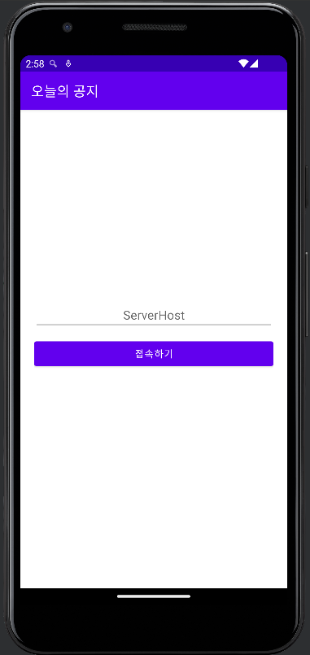
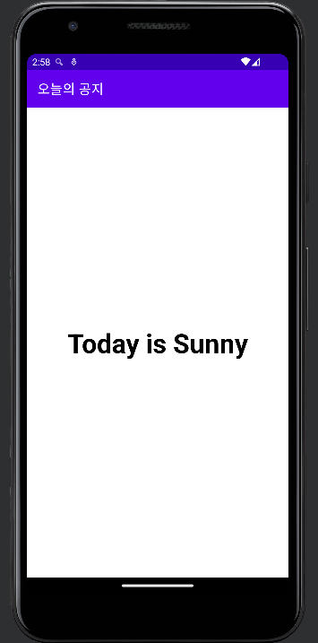

# 오늘의공지 (part2 - chapter 3)

## 이 챕터를 통해 배우는 것

1. Socket 이란 ?
    1. ServerSocket 으로 간단 Socket 서버 구현하기
    2. Socket 통신으로 Client 에서 데이터 송신받기
2. OkHttp 를 통해 데이터 가져오기
3. GSON 을 통해 JSON 형식 데이터 가져오기

### OkHttp

효율적으로 HTTP 통신을 할 수 있도록 도와주는 라이브러리

안드로이드 내부의 URL 클래스의 http 처리도 OkHttp 를 이용해서 구현이 되어 있음

[https://square.github.io/okhttp/](https://square.github.io/okhttp/)

### Socket

네트워크 상에서 데이터를 통신할 수 있도록 연결해주는 End-point

연결 요청, 연결 수락, connection, close 상태를 거침

실시간 데이터 통신, 양방향 데이터 통신

### HTTP / HTTPS

Hyper Text Transfer Protocol (Secure)

HTML 문서를 주고받기위한 통신 규약

단방향 통신, 클라이언트의 요청, 서버의 응답, 응답 이후는 연결을 끊음

**요청 시**

Request Line / Header / Body 의 구성을 가짐

- Request Line : 메서드 (GET / POST), 버전, URL, 등의 정보
- Header : 기본 구조에 정의된 대로 서버에 전달하는 정보
- Body : 요청에 들어가는 Data, 단순 데이터 요청 시에는 사용하지 않음

**응답 시** 

Status Line / Header / Body 의 구성을 가짐

- Status Line : 상태 코드 (200 / 404), 버전 등의 정보
- Header : 기본 구조에 정의된 대로 서버에 전달하는 정보
- Body : 실 데이터
